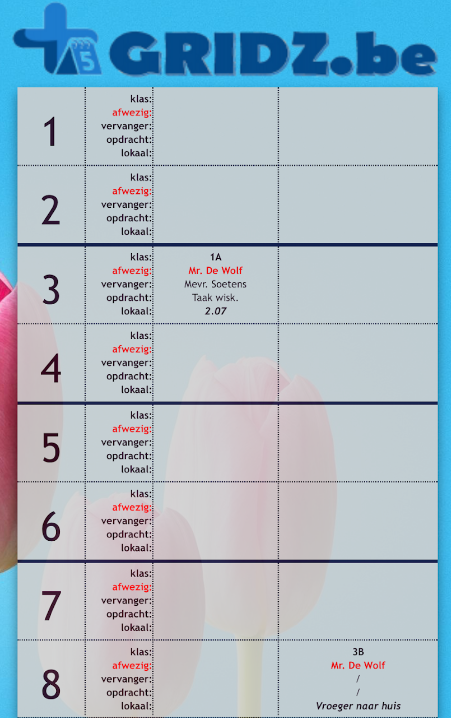

Dit is wat de leerkracht Patrick de Wolf van Sint-Jans-Molenbeek heeft gemakt. Na een gesprek dat hij hadt kreeg hij een idee om zelf een ap te maken. Het doel was het systeem om afwezigheden van leerkrachten te registreren. Hij wou het heel eenvoudig maken maar ook heel handig dus hij heeft wat extra functies in de app bijgevoegd. Een leekracht kan zelfs een maand tevoor melden dat hij of zij afwezig zal zijn. Je kan een examen module opstellen. Er is een mogelijkheid om door de app naar de een groot beeld te sturen zoals de schermen dat wij hebben op school. Je kan de app ook personaliseren. de app heet [GRIDZ](https://gridz.be/)

                     MIJN GEDACHTEN
Als eerste zou die app heel handig zijn omdat het echt wel onduidelijk kan zijn. Maar het feit dat het door een informatica leerkracht is gemaakt maakt mij blij want het geeft mij het gevoel dat zelf ik iets simpel kan maken. Al denk ik wel dat het hem een lange tijd heeft geduurt om het te maken en hij praatten ook over geld verdienen door commercialiseren om de geld terug in de app te doen om meer functies te kunnen bijvoegen maar ik weet niet waarom het geld zou kosten om dat te doen als hij de enige werker is.

[de tekst](https://schoolit.be/platform/nieuws/informatica-leerkracht-ontwerpt-zelf-digitale-afwezighedenrooster/)

[overzichtpagina](overzichtpagina.md)