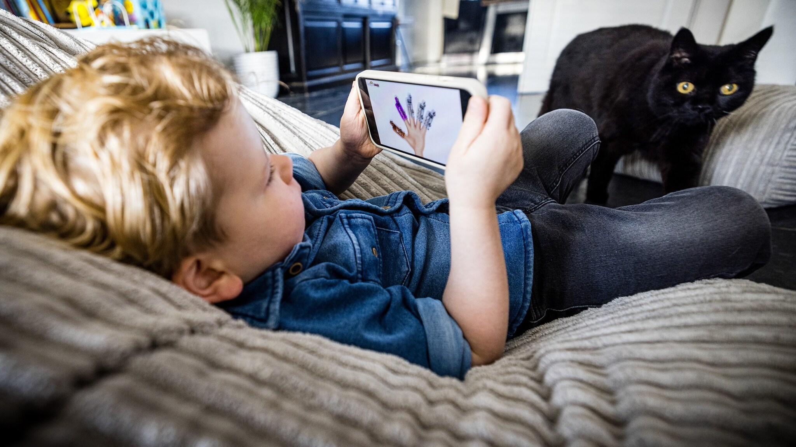

In dit artikel wordt er verteld over hoe jongeren te lang naar het scherm kijken en dat het slecht is voor hun ontwikkeling. Gemiddeld besteden kinderen tot en met 6 jaar 100 minuten per dag aan digitale media maar 1 op 4 ouders laten hun kinderen in de kind zijn eerste 2 jaren een uur per dag voor een tablet of telivisie zitten. Dit zorgt voor een aantal problemen. Eerst bewegen ze minder wat belangrijk is voor hun ontwikkeling. De slaap- en taalontwikkeling kan ook verstoord worden en natuurlijk is te veel scherm niet goed voor de ogen zeker niet die van een hele jonge leeftijd.

                     MIJN GEDACHTEN

Ik vind dit wel een beetje eng want ik zie dat ook echt. Ik zie hele jonge kinderen op hun telefoon in publiek. Ik ben ook echt een schermpersoon ik ga niet graag naar buiten. Zelfs op vakantie blijf ik liever in de hotel kamer in plaats van naar buiten gaan in het ander land. Maar ik was en had geen scherm op zo'n jonge leeftijd dus het is echt wel angstjagend.

[Bron](https://www.rtlnieuws.nl/nieuws/nederland/artikel/5373679/tablet-televisie-kijken-who-netwerk-mediawijsheid)