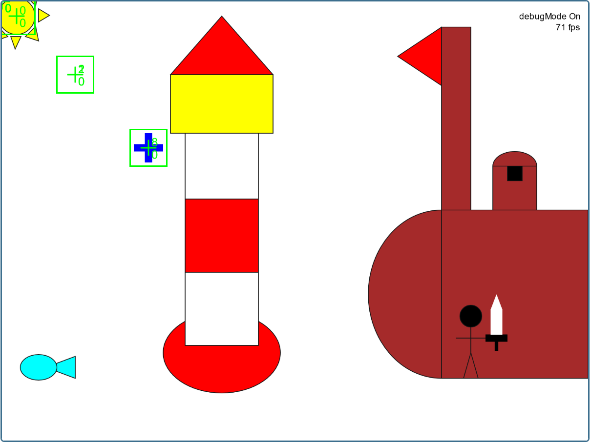
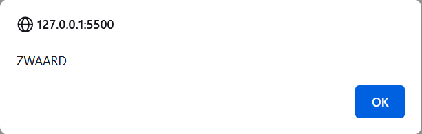

                  HIDDEN OBJECT GAME

Dit project moest met Javascript. We maakten een klein en simpel spel. Bij mijn spel kon je klikken op het voorwerp op de tekening waar je woord van kreeg om het volgend woord te krijgen.

Ik had een klasse voor elk ding dat er in de afbeelding is bv. vuurtoren. alle dingen waren zelfgemaakt zelfs de blauwe cursos die je kon bewegen met de pijltoetsen.

Dit is hoe je de woord kreeg. De volgorde van de woorden waren niet willekeurig maar voorbeslists het is veel makkelijker op dat manier omdat ik het laatste woord "gewonnen" kan maken in plaats van het willekeurig te doen en de woord "willekeurig" een uitzondering te maken. Dit spel werkt jammergenoeg niet, ik weet niet wat de probleem is maar het volgende woord komt nooit.   

Mijn andere projecten: 

°[overzicht pagina](overzichtpagina.md)

°[hidden object game](hiddenobjectgame.md)

°[html toets](htmltoets.md)

°[superhero website](superherowebsite.md)

