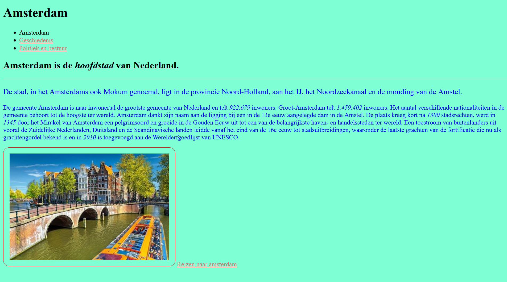

                         HTML TOETS

Voor deze toets maakten we een website over een stad. Om onze html en css kennis te testen je moest kunnen navigeren naar de andere pagina met een hyperlink en je moest de uiterlijk van uw website veel veranderen met css.

Ik had: een titel, een navigatiebalk, een tekst, een afbeelding en een hyperlink naar een ander website dat uw informeert over reizen naar Amsterdam. Er is ook een lijn rondom het afbeelding sinds dat was gevraagd.

