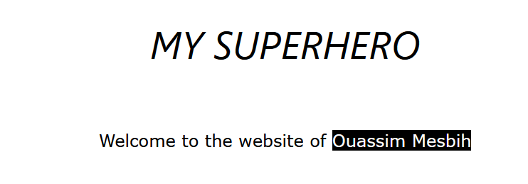
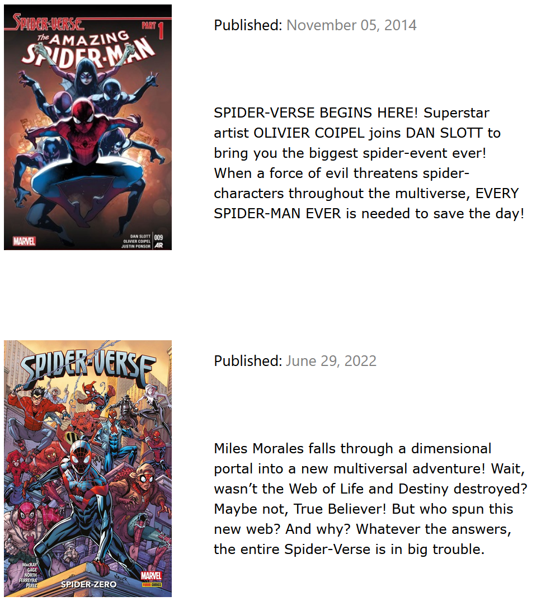
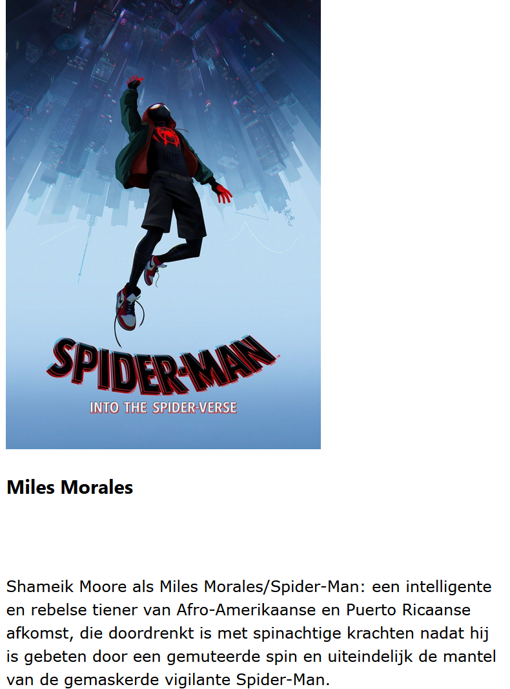
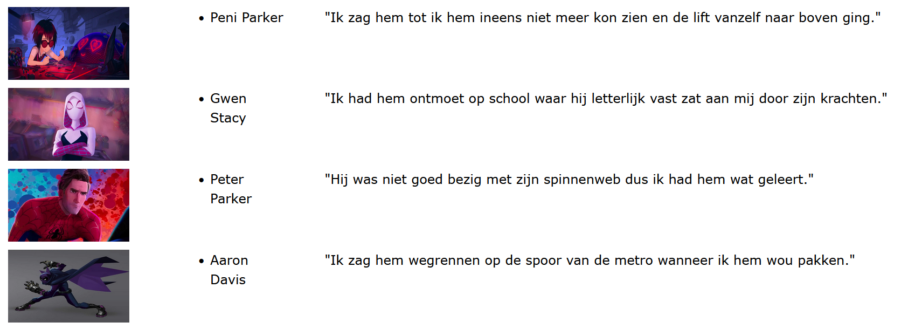
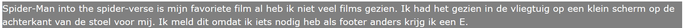
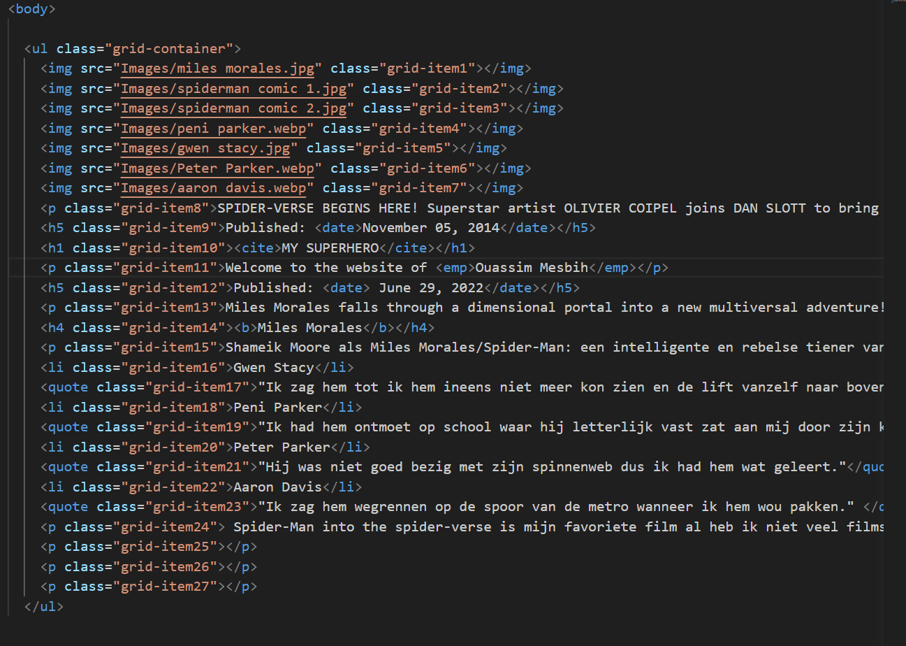

                 SUPERHERO WEBSITE

Voor dit opdracht gingen we een website maken over uw favoriete superheld. We moesten met grids werken en een ander site als inspiratie gebruiken.

Mijn site bestond uit 5 delen.

                     1. De titel

Deze titel is heel simpel het enige speciaal ding dat ik heb gedaan is mijn naam een zwart achtergrond geven met een wit lettertype.

                     2. De comics

Dit is een goed voorbeeld met hoe ik de grids heb gebruikt. De twee afbeeldingen hebben dezelfde breedte en hoogte en de datum heb ik in het grijs gekleurd.

                     3. De artikel

Er is niks speciaal aan dit stuk van de website maar het past goed. De titel is wel vetgedrukt.

                     4. De getuigen

Alles in deze afbeelding zit in een niet-geordend lijst. Je hebt een afbeelding van elk personage met hun naam en wat ze hebben gezegd. De positie van alles is beïnvloed geweest door grids en alle afbeeldingen hebben dezelfde hoogte en breedte.

                     5. De footer

De footer is erg simpel en is alleen in mijn site omdat het moest. Het heeft een grijs achtergrond met een wit lettertype.

                     EERVOLLE VERMELDINGEN 

Ik ben heel trots op dit project door hoe mooi de webstite er uitzag en hoe wel geordenend mijn code was.

Dit is heel mijn body dat is hoe simpel het werd met grid-container. Alles was waar het moest zijn.

Mijn andere projecten: 

°[overzicht pagina](overzichtpagina.md)

°[hidden object game](hiddenobjectgame.md)

°[html toets](htmltoets.md)

°[superhero website](superherowebsite.md)
